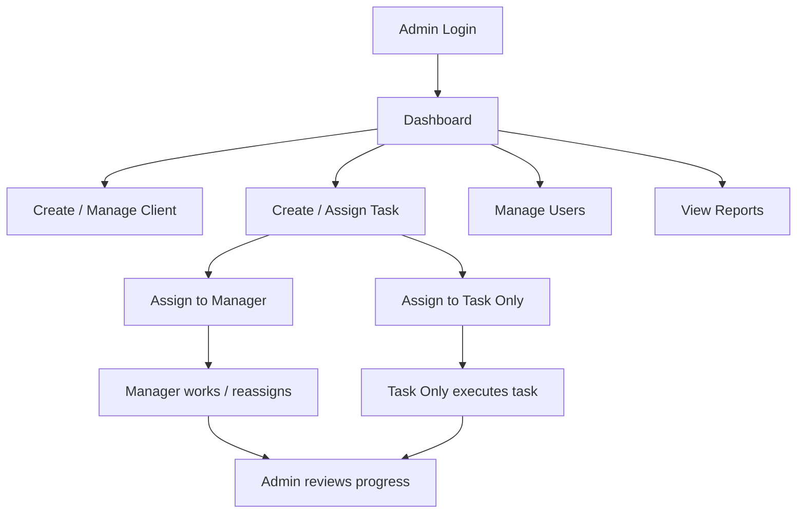

# Admin Role Architecture

## 1. Role Overview

The `admin` role is the highest authority in the Filing Buddy system.

Admin users are responsible for:
- full system control
- work assignment
- deletion authority
- user management
- setup and monitoring
- operational oversight

This role is the control layer of the application.

---

## 2. Admin Responsibilities

An admin can:
- create clients
- edit clients
- delete clients
- create tasks
- edit tasks
- assign tasks to any user
- reassign tasks
- delete tasks
- manage users
- change user roles
- activate or deactivate users
- manage categories and task types
- manage client groups
- view reports
- review dashboard analytics
- monitor FTA workflows
- review notifications and activity logs

---

## 3. Admin Functional Scope

### Clients
- add new client records
- edit full client profile
- upload client documents
- bulk upload clients
- permanently delete clients when required

### Tasks
- create tasks for any client
- assign tasks to admin, manager, or task-only users
- edit all task fields
- change task status
- update FTA status
- delete tasks
- manage recurring task setups

### Users
- add new users
- update user details
- change role between `admin`, `manager`, and `task_only`
- deactivate users
- delete non-admin users

### Reports and Monitoring
- view dashboard
- view task reports
- view user-wise reports
- view client-wise reports
- view overdue reports
- view FTA tracker reports
- review login activity and task activity

---

## 4. Admin Screen Access

Admin can access:
- Dashboard
- Add Client
- Client List
- Bulk Upload
- Contact Directory
- Add Task
- Task List
- FTA Tracker
- Categories & Task Types
- User Management
- Client Groups
- Reports

Admin has full sidebar visibility.

---

## 5. Admin API Access

### Auth
- `POST /api/auth/login`
- `GET /api/auth/me`
- `PUT /api/auth/change-password`

### Clients
- `GET /api/clients`
- `GET /api/clients/:id`
- `POST /api/clients`
- `PUT /api/clients/:id`
- `DELETE /api/clients/:id`
- `POST /api/clients/bulk-upload`
- `GET /api/clients/export`

### Tasks
- `GET /api/tasks`
- `GET /api/tasks/:id`
- `POST /api/tasks`
- `PUT /api/tasks/:id`
- `PATCH /api/tasks/:id/status`
- `PATCH /api/tasks/:id/fta-status`
- `DELETE /api/tasks/:id`
- `GET /api/tasks/export`
- `GET /api/tasks/fta-tracker`

### Users
- `GET /api/users`
- `GET /api/users/:id`
- `POST /api/users`
- `PUT /api/users/:id`
- `PATCH /api/users/:id/role`
- `PATCH /api/users/:id/status`
- `DELETE /api/users/:id`

### Contacts
- `GET /api/contacts`
- `POST /api/contacts`
- `PUT /api/contacts/:id`
- `DELETE /api/contacts/:id`

### Reports
- `GET /api/reports/dashboard-stats`
- `GET /api/reports/login-activity`
- `GET /api/reports/task-activity`
- `GET /api/reports/client-wise`
- `GET /api/reports/user-wise`
- `GET /api/reports/overdue`
- `GET /api/reports/fta-tracker`

---

## 6. Admin Connectivity With Other Roles

Admin connects directly with both `manager` and `task_only` users.

### Admin -> Manager
- admin creates manager users
- admin can assign tasks to managers
- admin can review manager workloads
- admin can override manager changes

### Admin -> Task Only
- admin assigns work directly
- admin reviews execution progress
- admin receives status updates through dashboard, reports, and logs

### Admin -> Whole System
- admin is the system owner for workflow continuity
- admin is the only role with delete authority
- admin controls access boundaries

---

## 7. Admin Workflow Diagram

---

## 8. Admin Data Ownership

Admin interacts with:
- `users`
- `clients`
- `tasks`
- `contacts`
- `clientgroups`
- `categories`
- `notifications`
- `activitylogs`

Admin has the broadest read/write scope across the database.

---

## 9. Admin Security Rules

Admin permissions must be enforced:
- in the frontend for visibility
- in the backend for true authorization

Important backend rules:
- only admin can delete clients
- only admin can delete tasks
- only admin can change roles
- only admin can manage user lifecycle

---

## 10. Summary

The `admin` role is the operational and governance authority of the project.

Admin is responsible for:
- controlling access
- assigning work
- deleting data where allowed
- managing users
- reviewing execution across the whole system

