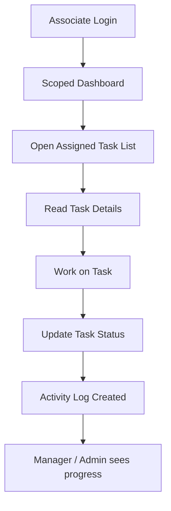

# Associate Role Architecture

## 1. Role Overview

The `associate` role is the work execution role in the Filing Buddy system.

Task-only users are responsible for:
- performing assigned work
- updating task progress
- completing operational tasks

This role is the delivery layer of the application.

---

## 2. Associate Responsibilities

A task-only user can:
- view assigned tasks
- open task details for assigned tasks
- update status of assigned tasks
- complete assigned work
- review their own dashboard-scoped work data

A task-only user cannot:
- create tasks
- assign tasks
- reassign tasks
- delete tasks
- create clients
- edit clients broadly
- delete clients
- manage users
- view admin reports
- manage categories
- access full FTA tracker

---

## 3. Associate Functional Scope

### Tasks
- see only tasks assigned to them
- update task status
- complete tasks
- contribute to activity log through their actions

### Clients
- view only clients connected to their assigned tasks
- use client information only as needed to complete task work

### Notifications
- receive notifications for assigned tasks
- receive updates when task status changes
- receive recurring-task notifications if assigned

---

## 4. Associate Screen Access

Task-only users should only access:
- Dashboard (scoped)
- Task List
- Task Detail / Task Edit only where their status updates are allowed
- Notifications

Task-only users should not access:
- Add Client
- Bulk Upload
- Contact Directory
- Add Task
- FTA Tracker
- Categories & Task Types
- Users
- Client Groups
- Reports

---

## 5. Associate API Access

### Auth
- `POST /api/auth/login`
- `GET /api/auth/me`
- `PUT /api/auth/change-password`

### Tasks
- `GET /api/tasks`
  - server must auto-filter to `assignedTo = current user`
- `GET /api/tasks/:id`
  - only if task belongs to current user
- `PATCH /api/tasks/:id/status`
  - only for assigned tasks

### Clients
- `GET /api/clients`
  - only clients linked to assigned tasks
- `GET /api/clients/:id`
  - only if user has assigned task for that client

### Dashboard
- `GET /api/reports/dashboard-stats`
  - must be scoped to assigned tasks and visible clients only

---

## 6. Associate Connectivity With Other Roles

Task-only users connect to both `admin` and `manager` through assigned work.

### Admin -> Associate
- admin can assign tasks directly
- admin can review output and status

### Manager -> Associate
- manager assigns day-to-day work
- manager follows task progress
- manager coordinates workload changes

### Associate -> System
- task-only users feed the system through status updates
- their work updates dashboard counts, notifications, and activity logs

---

## 7. Associate Workflow Diagram

---

## 8. Associate Data Ownership

Task-only users interact with:
- `tasks` assigned to them
- `clients` connected to those tasks
- `notifications` addressed to them
- `activitylogs` created from their actions

They do not have broad write control across the database.

---

## 9. Associate Security Rules

Important backend rules:
- `/api/tasks` must auto-filter by assigned user
- `/api/tasks/:id` must reject access if the task is not assigned to the current user
- task-only users cannot call create/update/delete task routes beyond allowed status updates
- task-only users cannot access manager/admin reports

Important frontend rules:
- hide assignment controls
- hide delete actions
- hide admin/manager-only screens

---

## 10. Summary

The `associate` role is the execution role of the system.

Task-only users are responsible for:
- doing assigned work
- updating progress
- completing task execution

They are not responsible for:
- assignment
- deletion
- management
- system governance

