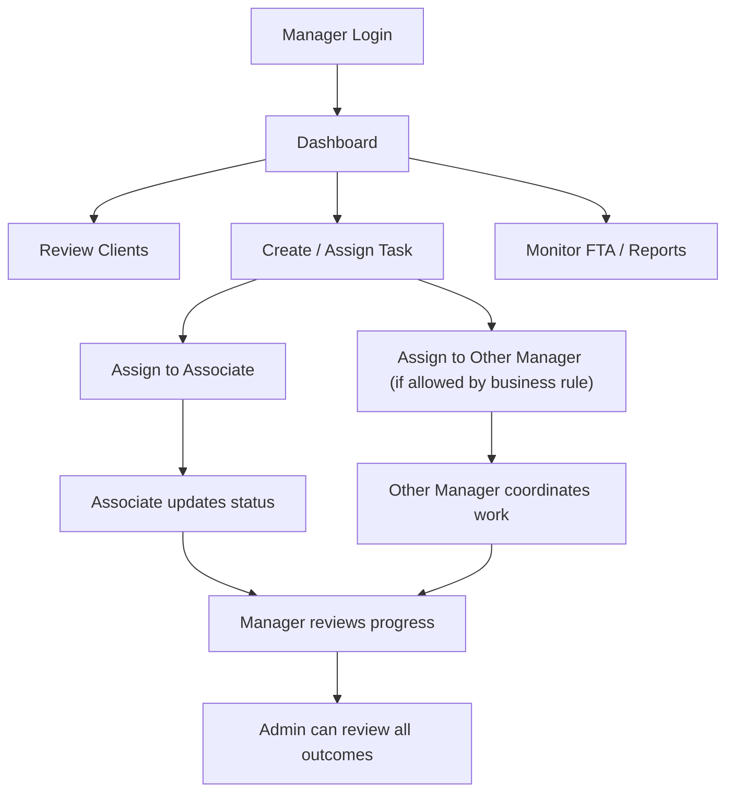

# Manager Role Architecture

## 1. Role Overview

The `manager` role is the operational coordination role in the Filing Buddy system.

Manager users are responsible for:
- managing work execution
- assigning work to staff
- monitoring client and task progress
- handling operational follow-up

This role is the execution management layer between admin and task-only users.

---

## 2. Manager Responsibilities

A manager can:
- create tasks
- edit tasks
- assign tasks
- reassign tasks
- update task status
- manage client records
- view reports
- view FTA tracker
- access user list for task assignment
- manage contacts

A manager cannot:
- delete tasks
- delete clients
- delete users
- change user roles
- manage categories if restricted to admin only
- assign work to admin users

---

## 3. Manager Functional Scope

### Clients
- view client list
- view client details
- edit client information
- upload client documents

### Tasks
- create tasks
- assign tasks to allowed users
- edit task details
- update status
- follow FTA workflow
- manage recurring task setup as part of task editing

### Users
- view users for assignment purposes
- understand who is available for task assignment
- cannot change roles or remove users

### Reports
- view dashboard
- view operational reports
- view overdue work
- view FTA reports

---

## 4. Manager Screen Access

Manager can access:
- Dashboard
- Client List
- Contact Directory
- Add Task
- Task List
- FTA Tracker
- User Management (view/assignment support only)
- Client Groups
- Reports

Manager cannot access admin-only creation/deletion areas such as:
- Add Client if the final business rule keeps it admin-only
- Bulk Upload if restricted to admin
- Categories & Task Types if restricted to admin

---

## 5. Manager API Access

### Auth
- `POST /api/auth/login`
- `GET /api/auth/me`
- `PUT /api/auth/change-password`

### Clients
- `GET /api/clients`
- `GET /api/clients/:id`
- `PUT /api/clients/:id`

### Tasks
- `GET /api/tasks`
- `GET /api/tasks/:id`
- `POST /api/tasks`
- `PUT /api/tasks/:id`
- `PATCH /api/tasks/:id/status`
- `PATCH /api/tasks/:id/fta-status`
- `GET /api/tasks/export`
- `GET /api/tasks/fta-tracker`

### Users
- `GET /api/users`
- `GET /api/users/:id`

### Contacts
- `GET /api/contacts`
- `POST /api/contacts`
- `PUT /api/contacts/:id`
- `DELETE /api/contacts/:id`

### Reports
- `GET /api/reports/dashboard-stats`
- `GET /api/reports/login-activity`
- `GET /api/reports/task-activity`
- `GET /api/reports/client-wise`
- `GET /api/reports/user-wise`
- `GET /api/reports/overdue`
- `GET /api/reports/fta-tracker`

---

## 6. Manager Connectivity With Other Roles

Manager connects upward to `admin` and downward to `associate`.

### Manager -> Admin
- admin can assign tasks to manager
- admin can review manager task handling
- admin can override manager actions

### Manager -> Associate
- manager assigns work to task-only users
- manager tracks progress
- manager follows up on due and overdue tasks
- manager can reassign work when needed

### Manager Workflow Position
- manager is the coordinator role
- manager does not own the system
- manager drives execution but without delete authority

---

## 7. Manager Workflow Diagram

---

## 8. Manager Data Ownership

Manager interacts with:
- `clients`
- `tasks`
- `users` (read-only for assignment visibility)
- `contacts`
- `notifications`
- `activitylogs`

Manager has operational write access, but not destructive authority.

---

## 9. Manager Security Rules

Important backend rules for manager:
- can assign tasks
- cannot assign tasks to admin
- cannot delete tasks
- cannot delete clients
- cannot change user roles
- cannot remove users

Important frontend rules:
- hide delete actions
- hide admin-only setup areas
- allow assignment UI only where manager is permitted

---

## 10. Summary

The `manager` role is the coordination and execution-management layer.

Manager is responsible for:
- assigning work
- following execution
- updating operations
- maintaining workflow continuity

Manager is not responsible for:
- deletion authority
- role governance
- system ownership

