# Filing Buddy Project Flow Architecture

## System Overview

Filing Buddy is a full-stack practice management system with:

- React frontend
- Express backend
- MongoDB database
- JWT authentication
- role-based access

## End-to-End Architecture

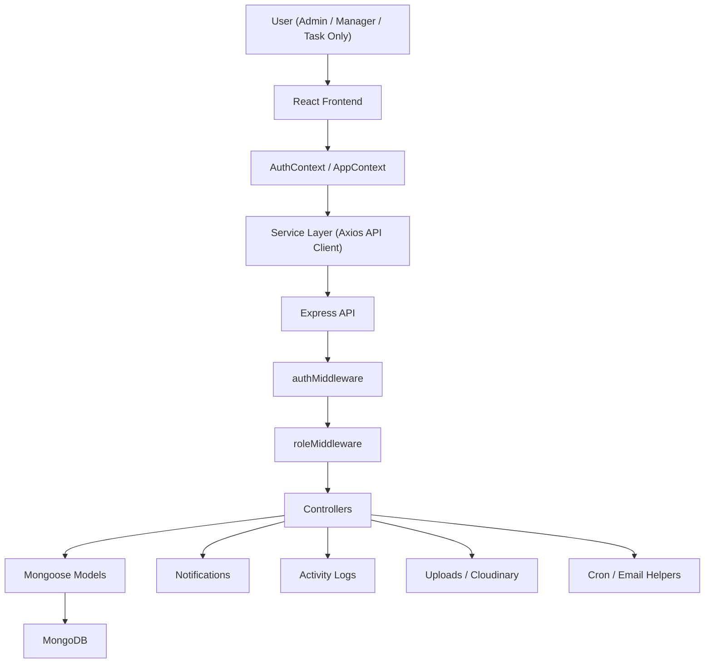

## Main Flow

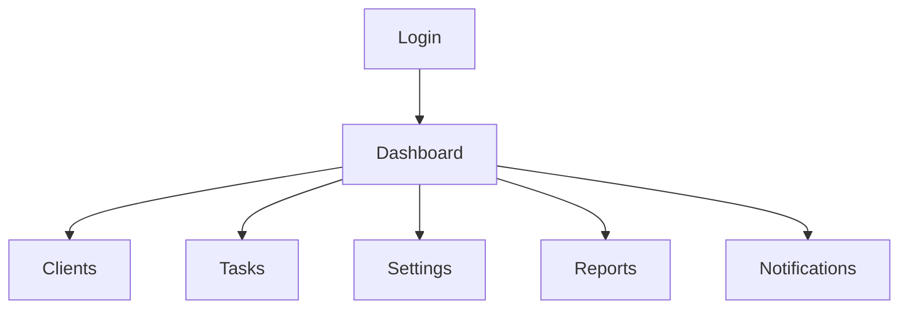

## Login Flow

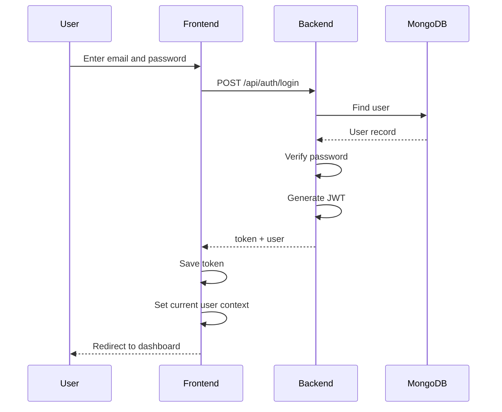

## App Navigation Flow

### Clients Module

```text
Dashboard
-> Add Client
-> Client List
-> Bulk Upload
-> Contact Directory
```

### Tasks Module

```text
Dashboard
-> Add Task
-> Task List
-> FTA Tracker
-> Categories and Task Types
```

### Settings and Reports

```text
Dashboard
-> Users
-> Client Groups
-> Reports
```

## Client Creation Flow

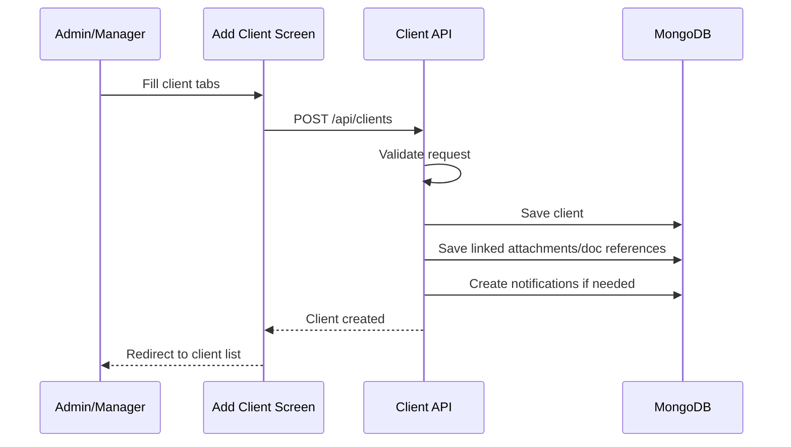

## Client Edit Flow

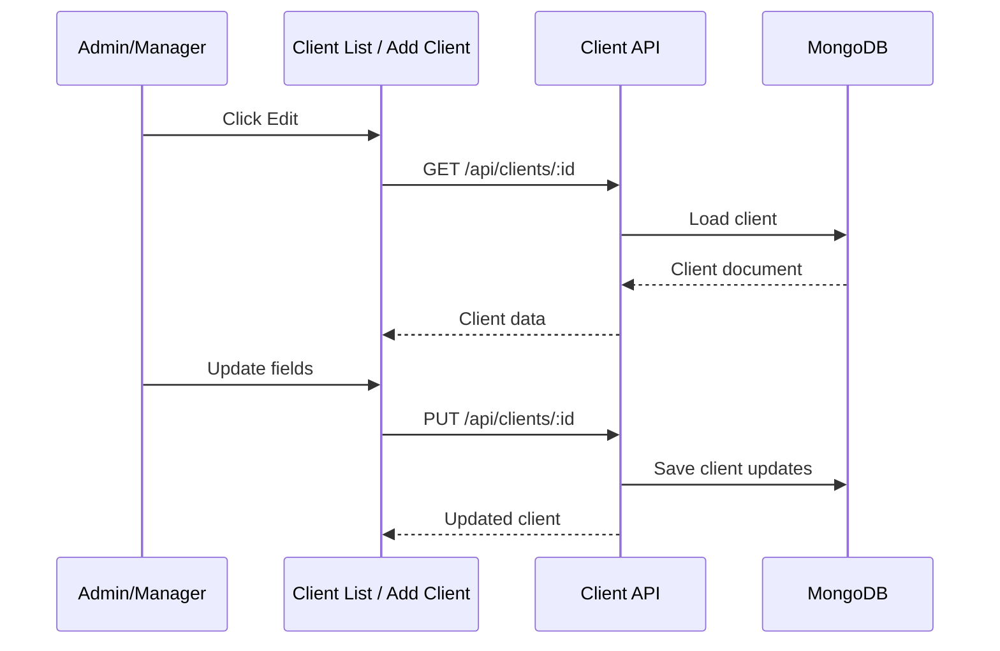

## Client Delete Flow

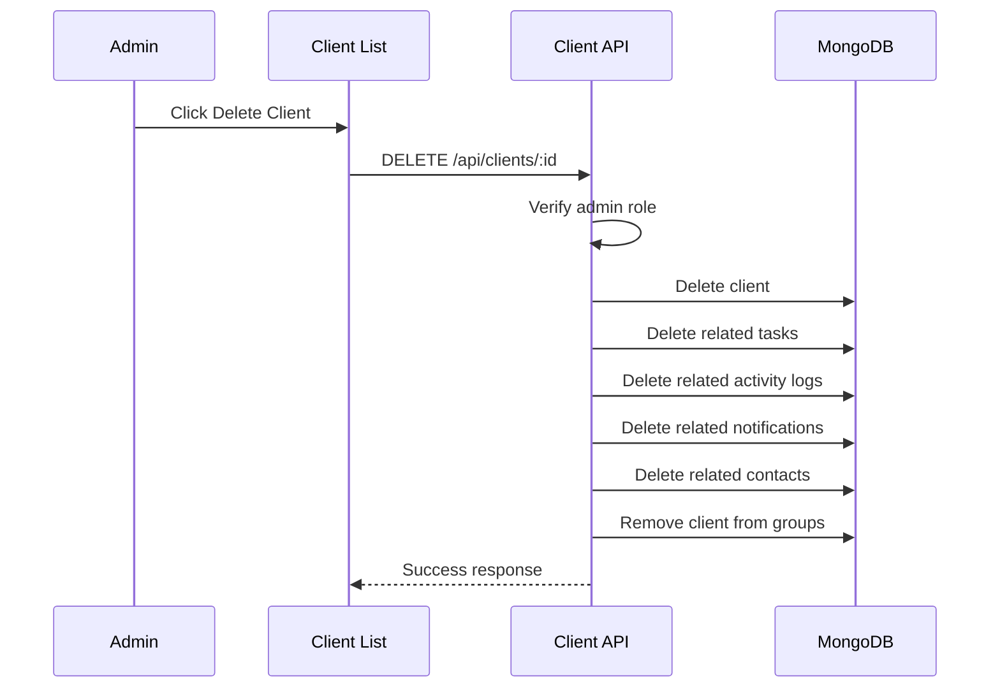

## Task Creation and Assignment Flow

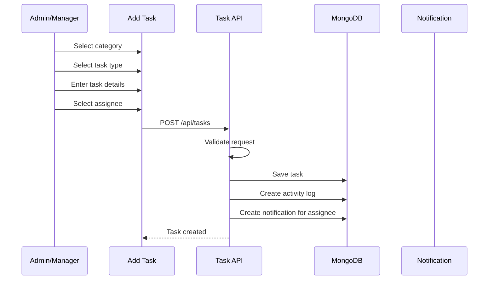

## Task Execution Flow

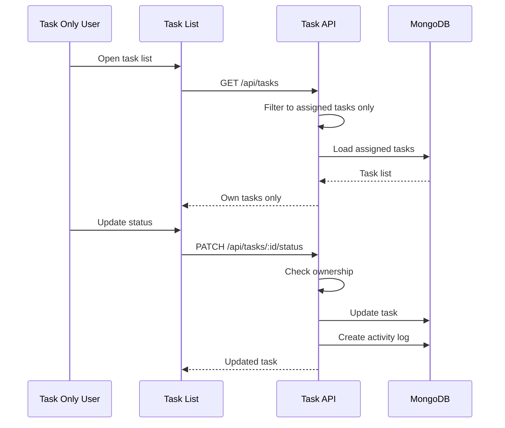

## Recurring Task Flow

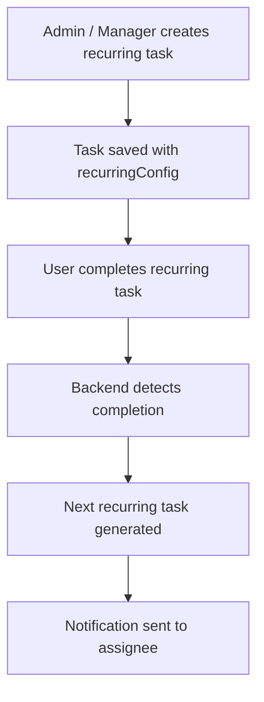

## FTA Tracker Flow

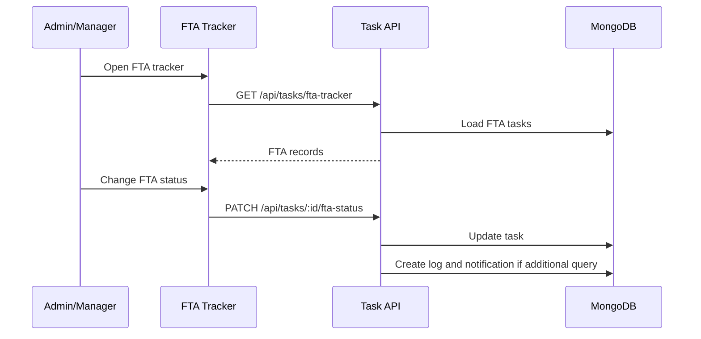

## Reports Flow

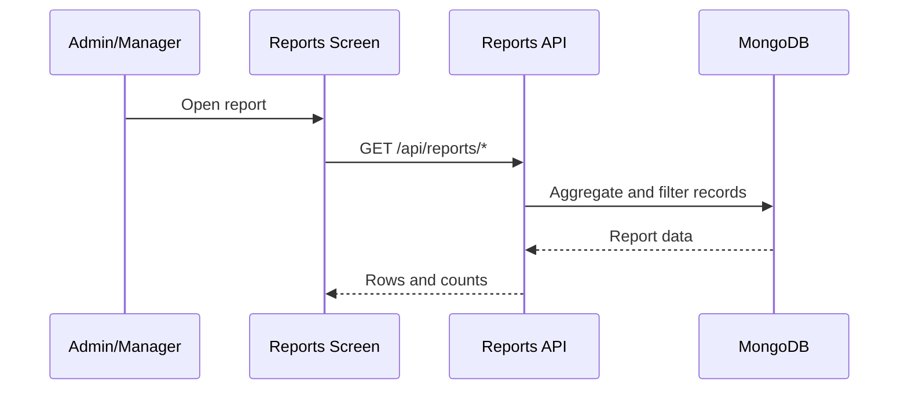

## Notification Flow

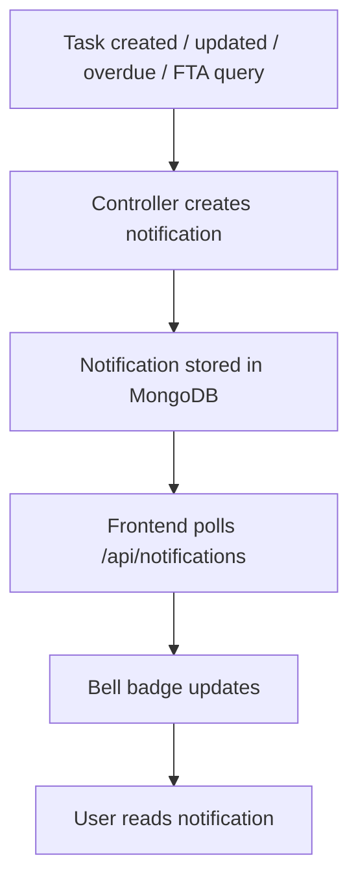

## Background Job Flow

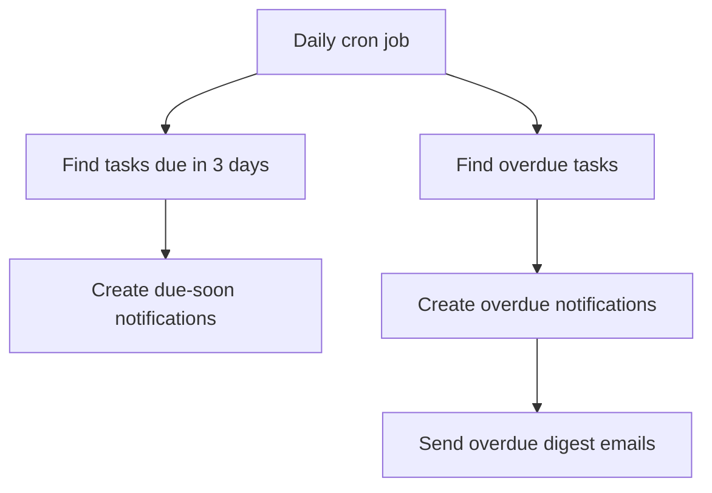

## Database Relationship Flow

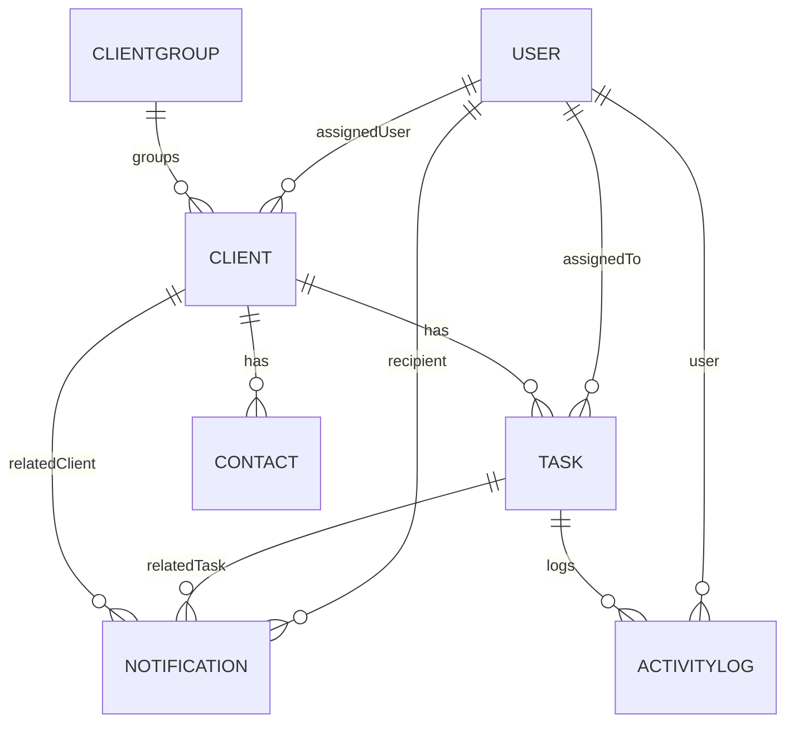

## Role-Based Screen Flow

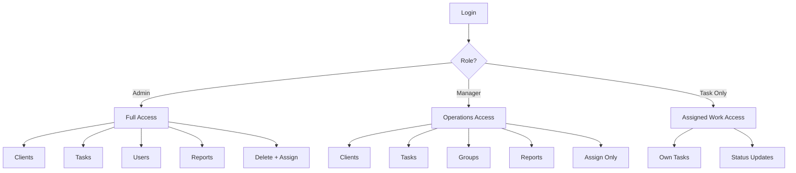

## Backend Request Architecture

```text
Frontend event
-> API service call
-> Express route
-> authMiddleware
-> roleMiddleware
-> controller
-> model
-> MongoDB
-> response
-> UI update
```

## Final Architecture Principle

The project should always follow these rules:

- frontend controls visibility
- backend controls permissions
- database stores truth
- JWT carries identity and role
- middleware enforces access
- controllers implement business logic
- logs and notifications record important actions

